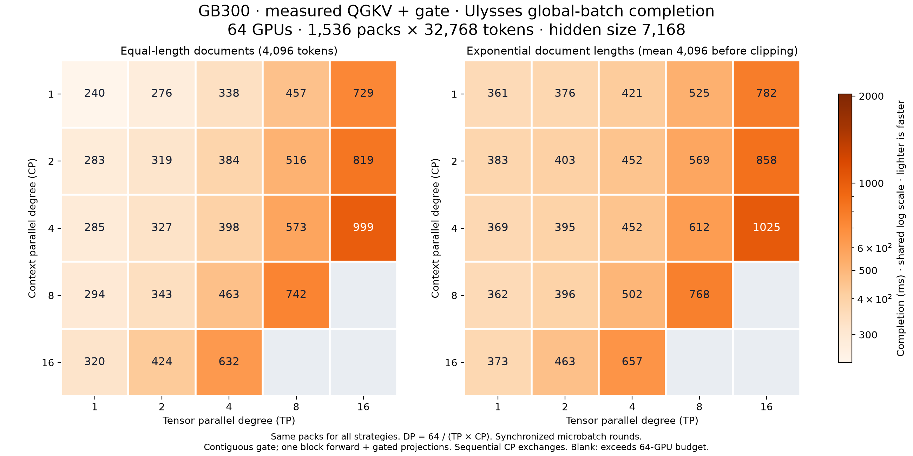

# Estimating Context Parallel

Analytical and empirical models for Ulysses, Ring, and ZigZag context
parallelism. The default model is causal, BF16, GQA-aware, and includes the
128-by-128 tile quantization used by FlashAttention-3 for head dimension 128.

The model estimates one attention forward pass. It is not an end-to-end
training model: projections, backward, collective latency, topology details,
and pipeline bubbles are outside its scope.

## Run

```bash
python -m pip install -e '.[test]'
python -m unittest discover -s tests -v
python -m src.main imbalance theoretical
python -m src.main cost-model
```

Use `--ideal-flops` to reproduce the theorem's smooth quadratic model and
`--no-plot` when only numerical output is needed.

GPU mode additionally requires Hopper-compatible FlashAttention-3, either as
`flash_attn_3.flash_attn_interface` or the legacy top-level
`flash_attn_interface`. It benchmarks causal varlen GQA using the actual maximum
sequence length in each pack.

## Important assumptions

- `dp` is the total device count; the number of independent DP/CP groups is
  `dp // cp`.
- Input sampling models concat-then-split packing. A document crossing a pack
  boundary becomes a new causal sequence.
- KV heads are replicated when Ulysses CP exceeds the GQA KV-head count.
- Ulysses QKV all-to-all, attention, and output all-to-all are added because
  they are data-dependent. Ring communication overlaps per-step computation.
- The tile-aware model counts scheduled matrix-multiply slots, then applies a
  roofline bound. The checked-in H100 calibration (`680 TFLOP/s` and `95 us`
  fixed cost) comes from `benchmarks/results/fa3_h100_results.json`; rerun
  `benchmarks/analyze_fa3_results.py` when changing FA or hardware.

## Ulysses projections with TP and sequence parallelism

`AttentionBlock` composes QKV/output projections and TP sequence-parallel
collectives with an attention strategy. Ulysses, ring, and zigzag strategies
accept `tp` and remain attention-only when used directly. The existing CLI
strategy comparisons are attention-only.

```python
from src.cost_model import AttentionBlock, GB300, UlyssesAttention

attention = UlyssesAttention(cp=4, tp=2, hw=GB300)
block = AttentionBlock(attention, hidden_size=7168)
seconds = block.total_time([8192, 8192, 8192, 8192])
```

To use measured GEMM times instead of the default roofline estimate:

```python
from src.cost_model import MeasuredGemmTimings

timings = MeasuredGemmTimings("benchmarks/calibrations/gemm_te211_gb300.json")
block = AttentionBlock(attention, hidden_size=7168, measured_gemms=timings)
seconds = block.total_time([8192, 8192, 8192, 8192])
```

The table contains 50 GB300 Max-Q / TE 2.11 BF16 ungated projection shapes.
Lookup uses `(M, K, N, dtype)` and returns the measured mean invocation time;
no extra launch or HBM cost is added. Missing shapes raise an error, with no
implicit fallback. Use this table only for matching hardware and backend.
Omit `measured_gemms` to select the analytical roofline model explicitly.

Set `gated_attention=True` on `AttentionBlock` to include the larger fused
QGKV projection. The gate adds one TP-local Q width; output projection and
collective costs are unchanged. A fused sigmoid/multiply is modeled as two
reads and one write over `(tokens / CP) * (Q_heads / TP) * head_dim` elements,
plus `HardwareConfig.gate_launch_latency`. This assumes bandwidth-bound gating;
scalar/sigmoid throughput is not calibrated, and invocation overhead defaults
to zero until measured. Gate cost is added in both analytical and measured-GEMM
modes, after CP output redistribution and before output projection. Measured
mode requires the resulting GEMM shape in the table; most gated shapes need
additional benchmarks.

Replace `UlyssesAttention` with `RingAttention` or `ZigZagAttention` to compare
strategies. Each retains its own CP communication and overlap model. Ring
strategies split heads across TP only, so CP is not limited by the head count.
Projection/SP phases are sequential around the strategy; ring kernel timing
uses the shared FlashAttention calibration and needs strategy-specific validation.

The forward sequence follows standard
[Megatron TP/SP projections](https://docs.nvidia.com/megatron-core/developer-guide/latest/apidocs/core/core.tensor_parallel.layers.html):

```text
SP all-gather -> QKV GEMM -> CP all-to-all -> attention
             -> CP all-to-all -> output GEMM -> SP reduce-scatter
```

`batch` contains the full sequence pack for a CP group, shared across TP ranks.
For total tokens S, hidden size H, and head dimension D:

- Layer input/output per rank: `[S / (CP * TP), H]`.
- Each projection processes `S / CP` tokens after the SP all-gather.
- QKV projection output width: `(TP-local Q heads + 2 * TP-local KV heads) * D`.
- FlashAttention Q heads per rank: `Q heads / (TP * CP)`; KV heads are
  replicated when the partition count exceeds the KV-head count.
- Output projection input width: `TP-local Q heads * D`; output width: H.
- Each SP collective transfers `(S / CP) * H * dtype_bytes * (TP - 1) / TP`
  bytes per rank. TP=1 has no SP communication.

`_gemm_compute_time` includes arithmetic and HBM traffic, like attention, using
`max(FLOPs / gemm_flops, input_weight_output_bytes / HBM_bandwidth)`
plus `HardwareConfig.gemm_launch_latency` (default zero, uncalibrated).
FlashAttention uses the separate `flash_flops` and `flash_launch_latency`
hardware fields. `gemm_flops` defaults to `None` until calibrated.
`AttentionBlock.total_time` adds both projections, the strategy's attention/CP
time, and `_sp_comm_time` for SP all-gather/reduce-scatter.
Placement assumes contiguous TP ranks: TP bandwidth uses TP group size, while
CP bandwidth uses the TP*CP span. This is a coarse bandwidth estimate without
collective startup latency, contention, or hierarchical collectives.
Normalization, RoPE, bias, dropout, backward, and MLP/MoE remain excluded.

## GB300 TP/CP sweep at fixed resources

This sweep holds 64 GB300 GPUs and 1,536 packs of 32,768 tokens fixed, with
one pack per microbatch and `DP = 64 / (TP * CP)`. The same packs are reused
across shardings. Documents are either 4,096 tokens long or sampled from an
exponential distribution with scale 4,096 (seed 0), using concat-then-split
packing.

The figure shows global-batch completion time, calculated by summing the
slowest DP group's time in each of
`1536 / DP` synchronized microbatch rounds. Independent DP progress would
reduce the exponential TP1/CP1 result from 361 ms to 281 ms; TP1/CP1 remains
the fastest for global-batch completion in both distributions.

These are model estimates for one attention block, including gated
projections with hidden size 7168 and sequential TP/CP/SP communication.
Backward and DP gradient communication are excluded. Blank cells exceed
64 query heads.



## Attention strategy comparison

The same packed workload and GPU budget are evaluated with `AttentionBlock`
for each strategy. Ulysses reproduces the original results; ring and zigzag
retain their existing kernel and communication-overlap approximations.
Completion plots use measured gated QGKV/output GEMMs and measured contiguous
gate invocation times, and share the same color scale. Gate measurements
replace the modeled gate cost; they are not added on top of it.
The analytical estimates remain available by omitting `measured_gemms`.

- [Ulysses completion](figures/cost_model/gb300_ulysses_measured_gemm_completion.png)
- [Ring completion](figures/cost_model/gb300_ring_measured_gemm_completion.png)
- [Zigzag completion](figures/cost_model/gb300_zigzag_measured_gemm_completion.png)
- [Combined comparison](figures/cost_model/gb300_attention_strategies_measured_gemm_completion.png)

Measured gated-attention TP/CP heatmaps (maximum across DP groups in the first microbatch round, fixed 32k packs):

- [Equal-length documents](figures/cost_model/gb300_gated_max_time_heatmap_equal_length.png)
- [Exponential document lengths](figures/cost_model/gb300_gated_max_time_heatmap_exponential.png)

Gated roofline global-batch forward completion (all 1,536 packs, synchronized rounds):

- [Equal-length documents](figures/cost_model/gb300_gated_roofline_completion_heatmap_equal_length.png)
- [Exponential document lengths](figures/cost_model/gb300_gated_roofline_completion_heatmap_exponential.png)

## Extended TP/CP sweep

```bash
python -m src.cost_model.sweep --gated-attention
```

Sweeps TP and CP over 1, 2, 4, 8, 16, 32, 64, using 64 GB300s and the same
1,536 packed 32k inputs per distribution. Outputs completion PNGs, CSV, input
packs and configuration under `results/tp_cp_sweep`. Change `--world-size`,
`--tp`, `--cp`, or `--strategies` to select a different sweep. Plot axes follow
the requested degrees. With 64 GPUs, 28 TP/CP pairs are valid per strategy.

The default uses roofline GEMMs and analytical gating. `--gemm-calibration`
selects exact measured GEMMs; missing shapes fail before the sweep starts.
The extended gated GEMM table covers all 28 valid pairs for this 64-GPU sweep. Ulysses requires
TP*CP to divide the query-head count; ring/zigzag partition heads by TP only.
Global pack count must be divisible by the derived DP degree.

To use measured TE 2.11 BF16 GEMMs for Ulysses (with the same analytical gate cost):

```bash
python -m src.cost_model.sweep --gated-attention --strategies ulysses \
  --gemm-calibration benchmarks/calibrations/gemm_te211_gated_gb300_extended.json \
  --output results/extended_ulysses_measured
```

Measured completion heatmaps: [equal-length](figures/cost_model/gb300_ulysses_extended_measured_completion_equal_length.png)
and [exponential](figures/cost_model/gb300_ulysses_extended_measured_completion_exponential.png).
